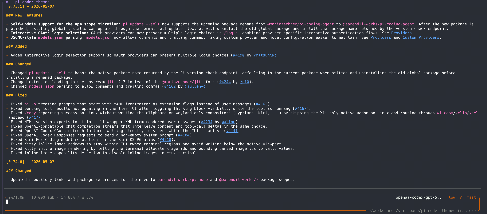

# pi-coder-theme

Pi Coder Theme UI for [Pi](https://pi.dev): a Pi Coder Theme dark theme, rounded editor chrome, synchronized thinking-level colors, compact user messages, and bundled compact tool rendering.



## Install

```bash
pi install npm:pi-coder-theme
```

Set the theme in Pi settings, or in `~/.pi/agent/settings.json`:

```json
{
  "theme": "pi-coder-theme-dark"
}
```

If `npm:pi-tool-display` is installed separately, remove it. `pi-coder-theme` already bundles it.

## Includes

- `pi-coder-theme-dark` theme
- Pi Coder Theme editor chrome with context, cost, ChatGPT subscription quota, model, thinking level, cwd, branch, and git change summary
- Working status integrated into the editor status row, with git changes kept on the right
- Goal-Driven worker status in the editor status row when `pi-goal-driven` publishes structured runtime status events
- Compact Pi Coder Theme user messages with thinking-level color sync
- Structured thinking-step display for visible assistant reasoning
- Bundled `pi-tool-display`

Structured thinking display turns visible provider reasoning into terminal-native steps while preserving the original reasoning text. If Pi's assistant-message internals are incompatible with this package version, pi-coder-theme warns and leaves Pi's native thinking renderer in place for that session.

ChatGPT quota display appears only for OpenAI/Codex models authenticated through Pi's subscription/OAuth login. It consumes subscription usage updates from `@marckrenn/pi-sub-core`, keeps the existing compact `5h … / W …` editor label, and refreshes through sub-core on the `chatGptQuota.refreshMinutes` interval from `config.json` (default 5 minutes). API-key sessions and unsupported providers do not show quota usage.

## Development

```bash
npm install
npm test
npm run typecheck
npm run check
npm run pack:check
```

For local Pi testing:

```bash
pi install /Users/frank/Code/pi-coder-theme
```

Switch back to the published package when done:

```bash
pi remove /Users/frank/Code/pi-coder-theme
pi install npm:pi-coder-theme
```

## Release

Use the bundled release skill/checklist:

```text
release-pi-coder-theme
```

At minimum:

```bash
npm run release:check
npm publish
```

See `CHANGELOG.md` for release notes.

## License

MIT
