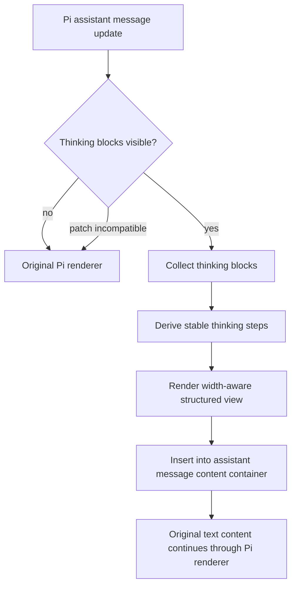

# feat: Add structured thinking steps display

## Summary

Add a pi-coder-theme-native structured thinking renderer inspired by `fluxgear/pi-thinking-steps`, using deterministic parsing and width-aware TUI rendering while preserving the original provider reasoning text. The plan adapts the external project’s concepts to this package’s current `@earendil-works/*` Pi runtime and keeps command/persistence behavior intentionally minimal for the first pass.

---

## Problem Frame

Pi already exposes thinking content, and this theme already customizes editor chrome, working status, and user-message rendering. Raw thinking blocks can still be visually noisy in a terminal; the requested improvement is to present that reasoning as structured steps without inventing or changing meaning.

---

## Requirements

- R1. Render assistant thinking content as structured steps rather than a raw block.
- R2. Preserve provider reasoning faithfully: parsing may derive boundaries and summaries, but must not invent synthetic reasoning.
- R3. Support terminal-native, width-aware rendering that does not exceed the render width and remains readable in narrow terminals.
- R4. Provide at least a compact/default view suitable for live streaming, with room to add richer modes later if desired.
- R5. Keep the implementation compatible with this package’s `@earendil-works/pi-coding-agent` and `@earendil-works/pi-tui` imports.
- R6. Fail safely if Pi internals are incompatible, leaving Pi’s native thinking renderer usable instead of breaking assistant message rendering.
- R7. Add regression coverage for parsing, rendering, patch compatibility, and package namespace expectations.

---

## Scope Boundaries

- Do not vendor or depend on `pi-thinking-steps` directly; use it as design reference and adapt the concepts to this package.
- Do not add project/global persistence or a full `/thinking-steps` command surface in the first pass unless implementation reveals an existing package convention that makes it nearly free.
- Do not change model thinking-level selection semantics; this work only changes how visible thinking is displayed.
- Do not change user message rendering, command palette behavior, ChatGPT quota display, or fixed editor layout except where integration requires safe coexistence.

### Deferred to Follow-Up Work

- Multi-mode user controls (`collapsed`, `summary`, `expanded`) and keybindings: follow-up if the default structured view proves useful.
- Persistent thinking display preferences: follow-up after the display shape is validated.
- README screenshots or SVG assets: follow-up release-polish work once the renderer is implemented and visually verified.

---

## Context & Research

### Relevant Code and Patterns

- `extensions/pi-coder-theme-editor.ts` already owns session lifecycle hooks, active thinking-level display, fixed editor compositing, status rendering, and safe stale-context handling.
- `extensions/pi-coder-theme-user-message.ts` demonstrates prototype patching against a public Pi component with reload-safe original-method storage and runtime theme access.
- `extensions/pi-coder-theme.test.ts` and `extensions/pi-coder-theme-stale-context.test.ts` provide current namespace, theme token, lifecycle, and stale-runtime regression patterns.
- `extensions/pi-coder-theme-command-palette.ts` shows the local style for small helpers and TUI-safe width handling.
- `themes/pi-coder-theme-dark.json` already defines `thinkingText` and thinking-level color tokens that the renderer should reuse before introducing new theme tokens.

### Institutional Learnings

- No relevant `docs/solutions/` learnings exist in this repository.

### External References

- `https://github.com/fluxgear/pi-thinking-steps` provides the reference shape: deterministic thinking parsing, semantic roles/icons, compact/summary/expanded render modes, and an internal patch around Pi’s assistant message component.
- Pi extension docs confirm supported public hooks for lifecycle events, commands, status, widgets, and UI components; full visible-thinking replacement still likely requires an internal assistant-message patch.
- Pi TUI docs require every component render line to stay within the provided width and recommend `visibleWidth`, `truncateToWidth`, and `wrapTextWithAnsi` for ANSI-safe output.

---

## Key Technical Decisions

- Adapt parser and renderer concepts locally instead of importing `pi-thinking-steps`: the reference package is pinned to the older `@mariozechner/*` namespace and depends on internal module paths that may not match this repo’s `@earendil-works/*` runtime.
- Keep parsing deterministic and conservative: derive step boundaries from headings, paragraph breaks, and list items, and summarize from visible text rather than generating new content.
- Introduce a small dedicated thinking module cluster under `extensions/thinking-steps/`: this keeps the structural display logic separate from the already-large editor extension and makes parser/renderer tests focused.
- Patch the assistant message rendering path behind compatibility checks: Pi’s public `setHiddenThinkingLabel` only changes hidden-thinking labels, so visible structured rendering needs an internal patch, but it must degrade safely.
- Reuse existing thinking/theme tokens first: `thinkingText`, `accent`, `muted`, `dim`, `success`, `warning`, and `error` are enough for first-pass rendering without expanding the theme contract.

---

## Open Questions

### Resolved During Planning

- Should the plan use the referenced package as a dependency? No. It is a design reference, but namespace/runtime differences make direct dependency riskier than local adaptation.
- Should this be integrated into the existing editor extension only? No. The editor extension can initialize/coordinate if needed, but parsing/rendering/patching should live in a dedicated module cluster.

### Deferred to Implementation

- Exact internal module path for `@earendil-works/pi-coding-agent` assistant message component: confirm during implementation because this is runtime-version-sensitive.
- Exact default display density: start with a compact structured view, then tune after seeing the rendered output in Pi.
- Whether a public Pi rendering hook has become sufficient in the installed runtime: check before finalizing the internal patch; if public API can replace the patch, prefer it.

---

## Output Structure

    extensions/
      thinking-steps/
        internal-patch.ts
        parse.ts
        render.ts
        state.ts
        types.ts
        index.ts
        parse.test.ts
        render.test.ts
        internal-patch.test.ts

---

## High-Level Technical Design

> *This illustrates the intended approach and is directional guidance for review, not implementation specification. The implementing agent should treat it as context, not code to reproduce.*

The patch should replace only the visible-thinking block rendering. Normal assistant text, hidden-label behavior, and non-thinking messages should remain owned by Pi’s native renderer.

---

## Implementation Units

### U1. Add deterministic thinking-step parser

**Goal:** Convert raw provider thinking text into stable, structured step objects with summaries, bodies, roles, and icons.

**Requirements:** R1, R2, R7

**Dependencies:** None

**Files:**
- Create: `extensions/thinking-steps/types.ts`
- Create: `extensions/thinking-steps/parse.ts`
- Create: `extensions/thinking-steps/parse.test.ts`

**Approach:**
- Define local types for source thinking blocks, derived steps, semantic roles, and render modes.
- Port the reference project’s conservative parsing ideas: normalize newlines, split by meaningful paragraph/list boundaries, keep standalone headings attached to their relevant body, and derive summaries from the first meaningful visible text.
- Classify semantic role from visible cues such as inspect/search/plan/compare/verify/write/error without changing the underlying body text.
- Keep hidden/redacted thinking explicitly marked so the renderer can label it without pretending to know hidden content.

**Execution note:** Implement parser behavior test-first because this unit defines the fidelity contract.

**Patterns to follow:**
- Reference behavior from `pi-thinking-steps` `parse.ts`, adapted to local style and package namespace.
- Test style from `extensions/pi-coder-theme-command-palette.test.ts` and `extensions/pi-coder-theme.test.ts`.

**Test scenarios:**
- Happy path: a two-paragraph thinking block produces two ordered steps with stable ids and body text preserved.
- Happy path: a markdown heading followed by explanatory text stays in the same step rather than creating an empty heading-only step.
- Happy path: a list with multiple top-level items produces separate scanable steps while preserving continuation lines under the correct item.
- Edge case: empty or whitespace-only thinking text produces no steps.
- Edge case: markdown emphasis/backticks in the first line are stripped or normalized only for summaries, not removed from the full body.
- Error path: redacted thinking with no visible text produces a redacted/hidden marker step rather than throwing.
- Regression: parser output is deterministic across repeated calls with the same input.

**Verification:**
- Parser tests prove step boundaries, summary derivation, role assignment, and redacted handling without requiring Pi runtime internals.

---

### U2. Add width-aware terminal renderer for structured steps

**Goal:** Render derived thinking steps into ANSI-safe terminal lines using this theme’s color tokens and Pi TUI width utilities.

**Requirements:** R1, R2, R3, R4, R7

**Dependencies:** U1

**Files:**
- Create: `extensions/thinking-steps/render.ts`
- Create: `extensions/thinking-steps/render.test.ts`
- Modify: `themes/pi-coder-theme-dark.json` only if implementation proves an existing token is insufficient

**Approach:**
- Implement a component-like renderer that accepts width, theme-like styling, steps, and active-state hints.
- Start with a compact structured output that shows a `Thinking` label plus the highest-signal current/latest step, and a summary block shape for complete messages if practical in the same renderer.
- Use `visibleWidth`, `truncateToWidth`, and `wrapTextWithAnsi` to ensure every emitted line fits the provided width.
- Sanitize control sequences from model-provided thinking before rendering.
- Use existing theme tokens before adding new ones; if new tokens are truly needed, update theme tests in the same unit.

**Execution note:** Test renderer width behavior before wiring it into Pi internals.

**Patterns to follow:**
- `extensions/pi-coder-theme-editor.ts` for truncation, visible-width accounting, and theme token usage.
- `pi-thinking-steps` `render.ts` for role icons, collapsed-step selection, and markdown-lite inline cleanup.
- Pi TUI docs on render width guarantees.

**Test scenarios:**
- Happy path: one planning step renders with a thinking label, role icon, and summary text.
- Happy path: multiple steps render in chronological summary order for a complete/non-active message.
- Edge case: a very narrow width still returns lines whose visible width is no greater than the requested width.
- Edge case: ANSI-colored summaries wrap or truncate without corrupting visible width accounting.
- Error path: raw control sequences in thinking text are stripped from rendered output.
- Regression: renderer uses existing theme token names and does not require a theme-file change unless explicitly introduced.

**Verification:**
- Renderer tests assert line widths, labels/icons, sanitization, and stable output for representative thinking content.

---

### U3. Add safe assistant-message patch layer

**Goal:** Replace Pi’s visible thinking rendering path with the structured renderer while preserving native rendering as fallback.

**Requirements:** R1, R5, R6, R7

**Dependencies:** U1, U2

**Files:**
- Create: `extensions/thinking-steps/internal-patch.ts`
- Create: `extensions/thinking-steps/state.ts`
- Create: `extensions/thinking-steps/internal-patch.test.ts`

**Approach:**
- Resolve the current `@earendil-works/pi-coding-agent` package root and import only the minimal internal assistant-message module needed for visible-thinking rendering.
- Validate the internal component shape before patching: required methods, content container capabilities, and original-render fallback behavior.
- Store original prototype methods and restore them on cleanup; make retain/release reference counting explicit so reload/session shutdown cannot double-unpatch.
- On incompatibility, surface a warning and leave the session on Pi’s native renderer.
- Keep ownership/state minimal: enough to know whether a message is active and whether a render refresh is needed, not full preference persistence.

**Execution note:** Add characterization tests around the patch guard/restore behavior before integrating with the extension entrypoint.

**Patterns to follow:**
- `extensions/pi-coder-theme-user-message.ts` for prototype patch safety and reload-aware original method storage.
- `pi-thinking-steps` `internal-patch.ts` for compatibility assertions, fallback-to-original behavior, and reference-counted cleanup concepts.
- Pi extension docs for `session_start`, `session_shutdown`, and stale runtime risks after reload/resume.

**Test scenarios:**
- Happy path: a fake compatible assistant message component receives patched visible-thinking rendering while non-thinking text still delegates to original behavior.
- Happy path: calling retain twice and release twice restores the original methods exactly once.
- Edge case: releasing with no active patch does not throw.
- Error path: missing internal methods cause patch installation to fail with a clear degraded-session result rather than modifying the prototype partially.
- Error path: renderer failure during a message update falls back to the original Pi update path.
- Regression: package resolution targets `@earendil-works/pi-coding-agent`, never the older `@mariozechner/pi-coding-agent` namespace.

**Verification:**
- Patch tests prove install, fallback, cleanup, and namespace behavior without requiring a live Pi TUI session.

---

### U4. Wire structured thinking extension into the package lifecycle

**Goal:** Load the thinking-steps integration as part of the package and connect it to Pi session lifecycle events.

**Requirements:** R1, R4, R5, R6

**Dependencies:** U3

**Files:**
- Create: `extensions/thinking-steps/index.ts`
- Modify: `package.json`
- Modify: `extensions/pi-coder-theme-editor.ts` only if the existing editor must coordinate status labels or render refreshes
- Modify: `extensions/pi-coder-theme.test.ts`

**Approach:**
- Register the new extension entrypoint in `package.json` after the editor chrome extension and before/after user-message styling based on whichever order avoids patch conflicts during implementation.
- On `session_start`, install or retain the patch only for UI sessions; set a lightweight status or notification only when degraded.
- On `message_update` and `agent_end`, update active/inactive state and request render so live thinking output refreshes without fighting the editor’s working-status updates.
- On `session_shutdown`, release the patch and clear active state.
- Avoid adding a command surface in this unit unless it is required to make the first-pass display usable.

**Patterns to follow:**
- `extensions/pi-coder-theme-editor.ts` lifecycle handling for UI-only setup, render requests, reload safety, and session shutdown cleanup.
- `pi-thinking-steps` `index.ts` for degraded-session handling and active-message state ideas, simplified for no persistence/commands.

**Test scenarios:**
- Happy path: package metadata includes the new extension entrypoint in `pi.extensions`.
- Happy path: UI `session_start` installs/retains the patch and `session_shutdown` releases it.
- Edge case: non-UI sessions skip patch installation.
- Error path: patch installation failure reports degraded status/notification and does not prevent other pi-coder-theme extensions from loading.
- Integration: assistant `message_update` with thinking content triggers active-state update and render request.
- Regression: existing editor tests for working messages, quota, thinking-level label, and user-message rendering still pass.

**Verification:**
- The package loads all configured extensions, and existing pi-coder-theme behavior remains intact around editor chrome and user-message rendering.

---

### U5. Update documentation and release-facing validation coverage

**Goal:** Document the new thinking display behavior and ensure package checks cover the new files.

**Requirements:** R3, R5, R7

**Dependencies:** U1, U2, U3, U4

**Files:**
- Modify: `README.md`
- Modify: `CHANGELOG.md`
- Modify: `extensions/pi-coder-theme.test.ts`
- Modify: `package.json` only if scripts need to include additional tests explicitly

**Approach:**
- Add a concise README section describing structured thinking display, its fidelity goal, and degraded fallback behavior.
- Add a changelog entry for the user-visible thinking display improvement.
- Ensure tests cover package namespace, extension registration, and any theme-token additions.
- Keep release instructions aligned with existing scripts: typecheck, tests, Pi load check, and package dry run.

**Patterns to follow:**
- Existing README package feature descriptions and command/check documentation.
- Existing CHANGELOG style.
- Existing `npm run release:check` coverage expectations from `AGENTS.md`.

**Test scenarios:**
- Happy path: package tests verify the new extension file is registered and included in package-facing metadata.
- Regression: namespace test scans the new thinking files for the current `@earendil-works/*` package names.
- Regression: if new theme tokens are added, theme token tests assert they are present and non-empty.

**Verification:**
- Documentation accurately describes the behavior and fallback, and package checks include the new extension files.

---

## System-Wide Impact

- **Interaction graph:** Assistant message rendering will gain a second prototype patch alongside the existing user-message patch. The two patches target different components but must both survive reload/resume flows.
- **Error propagation:** Patch install or render failures should warn/degrade and delegate back to Pi’s original renderer, not throw through session startup or message update.
- **State lifecycle risks:** Reference-counted patch cleanup must handle reload, shutdown, and failed partial installs without leaving stale prototype methods.
- **API surface parity:** No public CLI, model, or thinking-level API changes are planned for the first pass.
- **Integration coverage:** Unit tests prove parser/renderer/patch behavior; `npm run check` remains necessary to confirm the extension package loads under Pi.
- **Unchanged invariants:** User-message styling, editor border/status behavior, command palette behavior, quota display, and fixed editor compositing should remain unchanged.

---

## Risks & Dependencies

| Risk | Mitigation |
|------|------------|
| Pi internal assistant-message paths differ from the reference package or change in future Pi versions | Resolve and assert the current `@earendil-works` internal shape at install time; degrade to native rendering on mismatch |
| Structured summaries accidentally distort reasoning | Keep summary derivation deterministic and text-based; preserve full body text for expanded/fallback paths |
| Rendered lines overflow terminal width | Centralize rendering through Pi TUI width utilities and test narrow widths |
| Prototype patch conflicts with future extensions | Patch only the required assistant-message methods, restore originals exactly, and keep cleanup reference-counted |
| Existing theme package checks miss new files | Extend package metadata/tests so new extension files are included and namespace-scanned |

---

## Documentation / Operational Notes

- The README should state that structured thinking is a display feature, not a reasoning transformation.
- The README should mention fallback behavior when Pi internals are incompatible.
- Release validation should run `npm run typecheck`, `npm test`, `npm run check`, and `npm run pack:check` because this touches extension code and package contents.

---

## Sources & References

- External reference: https://github.com/fluxgear/pi-thinking-steps
- Related code: `extensions/pi-coder-theme-editor.ts`
- Related code: `extensions/pi-coder-theme-user-message.ts`
- Related tests: `extensions/pi-coder-theme.test.ts`
- Related tests: `extensions/pi-coder-theme-stale-context.test.ts`
- Pi docs: `@earendil-works/pi-coding-agent` `docs/extensions.md`
- Pi docs: `@earendil-works/pi-coding-agent` `docs/tui.md`
