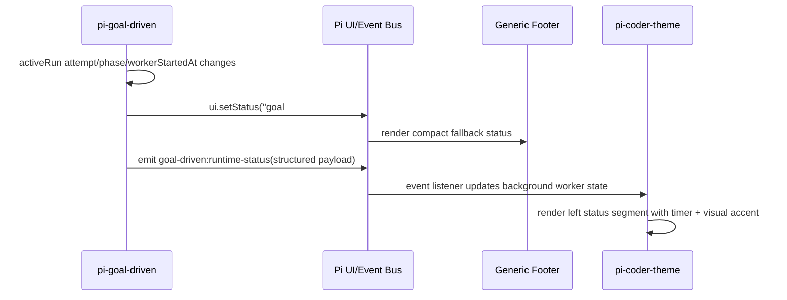
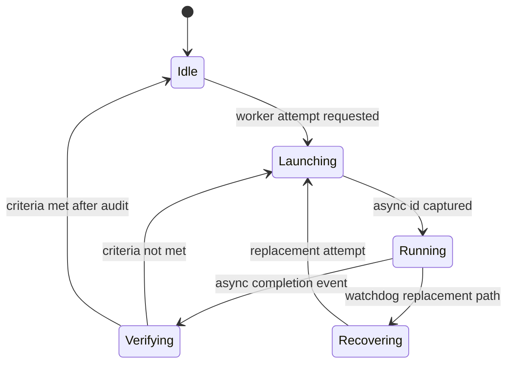

# feat: Add Goal-Driven Worker Status UI

## Summary

Add theme-agnostic Goal-Driven worker runtime status so async subagent attempts show elapsed time and attempt count cleanly across generic Pi footers, while `pi-coder-theme` renders the same structured status in the left status area with visual treatment matching the main agent timer.

---

## Problem Frame

`pi-goal-driven` currently exposes active worker state as a long `ui.setStatus()` string, which is hard to read in native and powerline-style footers. `pi-coder-theme` also only times the parent agent turn, so users see an active background worker but no corresponding left-side runtime indicator.

---

## Requirements

- R1. `pi-goal-driven` must expose worker attempt count and elapsed runtime in a compact, readable status for generic themes.
- R2. `pi-goal-driven` must remain theme-agnostic and avoid depending on `pi-coder-theme` internals.
- R3. `pi-goal-driven` must publish structured runtime status that richer themes can consume without parsing display strings.
- R4. `pi-coder-theme` must show active Goal-Driven worker status in the left status row alongside the existing main agent timer.
- R5. The subagent display should use visual structure consistent with the main timer and include chart-like progress/phase accents where terminal width allows.
- R6. Existing behavior must remain unchanged when `pi-goal-driven` is not installed or no worker is active.

---

## Scope Boundaries

- Do not reimplement the `pi-subagents` async runtime or lower async widget inside `pi-goal-driven` or `pi-coder-theme`.
- Do not make `pi-goal-driven` import, configure, or special-case `pi-coder-theme`.
- Do not rely on parsing verbose status strings, async output logs, or private temp-directory layout in `pi-coder-theme`.
- Do not change the master/worker verification rules, watchdog policy, or retry semantics beyond recording and presenting their current state.

### Deferred to Follow-Up Work

- Generalize a cross-plugin `extension:runtime-status` standard after one concrete provider/consumer pair has proven the shape.
- Add interactive drill-down UI for worker logs or status history; this plan covers compact live status only.

---

## Context & Research

**Target repos:** this plan spans `pi-goal-driven` and `pi-coder-theme`. File paths below are repo-relative within the named target repo.

### Relevant Code and Patterns

- `pi-goal-driven:index.ts` owns Goal-Driven run state, worker attempt tracking, async launch interception, completion handling, and the current `refreshStatus()` implementation.
- `pi-goal-driven:index.test.ts` already tests lifecycle helpers and should cover the new status model/formatter.
- `pi-coder-theme:extensions/pi-coder-theme-editor.ts` owns main agent elapsed timing via `before_agent_start` / `agent_end`, the left status row, footer status consumption, and event-bus usage.
- `pi-coder-theme:extensions/pi-coder-theme-stale-context.test.ts` already covers elapsed time formatting and extension status rendering.
- Current code already uses `pi.events.emit()` / `pi.events.on()` for sub-core communication, so a structured event channel follows an existing extension integration pattern.

### Institutional Learnings

- No repo-local `docs/solutions/` learnings were found for this task.

### External References

- No external research needed; this is an internal plugin integration using existing Pi extension patterns already present in the two repositories.

---

## Key Technical Decisions

- Use a dual-channel status model: `ui.setStatus()` remains the universal fallback, and a structured event carries richer data for custom themes.
- Keep `pi-goal-driven` as the source of truth for Goal-Driven attempt state, phase, and active worker elapsed time.
- Let `pi-coder-theme` consume structured Goal-Driven status opportunistically; absence of the event means no worker segment is rendered.
- Render subagent elapsed status as a separate background-worker segment rather than folding it into the main agent timer, preserving the distinction between parent turn time and worker runtime.
- Add compact visual accents in `pi-coder-theme` with width-aware fallback: rich mode can show a small activity bar/sparkline-style phase glyph, while narrow mode falls back to plain `sub #N 9m54s` text.

---

## Open Questions

### Resolved During Planning

- Should the implementation be bound to `pi-coder-theme` only? No. `pi-goal-driven` should improve generic footer output first and expose structured data as an optional enhancement path.
- Should `pi-coder-theme` parse `ui.setStatus()` strings? No. It should listen for structured runtime status events.

### Deferred to Implementation

- Exact event payload field names may be refined during implementation to match TypeScript ergonomics and Pi extension API typing.
- Exact glyphs/colors for the chart-like segment should be finalized after seeing terminal rendering at normal and narrow widths.

---

## High-Level Technical Design

> *This illustrates the intended approach and is directional guidance for review, not implementation specification. The implementing agent should treat it as context, not code to reproduce.*

---

## Implementation Units

### U1. Add Goal-Driven runtime status model

**Goal:** Centralize Goal-Driven UI state into a typed runtime status object that includes phase, attempt count, async id, worker start time, elapsed time, and a compact label.

**Requirements:** R1, R2, R3

**Dependencies:** None

**Files:**
- Modify: `pi-goal-driven:index.ts`
- Test: `pi-goal-driven:index.test.ts`

**Approach:**
- Add a runtime status builder that derives display-ready state from `activeRun` and `activeBrainstorm` rather than formatting directly inside `refreshStatus()`.
- Add `workerStartedAt` or equivalent active-attempt timestamp to Goal-Driven run state and update it when async launch succeeds.
- Preserve attempt semantics: attempt increments when the master launches a worker attempt, elapsed time measures the currently active worker attempt, and completion transitions to verifying without pretending the worker is still running.
- Model recovery/watchdog states as status states so the footer can show `recovering` or `stalled` without embedding long diagnostic text.

**Patterns to follow:**
- Existing `activeRun.attempt`, `activeRun.phase`, `activeRun.activeAsyncId`, and `activeRun.lastEvent` handling in `pi-goal-driven:index.ts`.
- Existing exported helper/test pattern near `formatScopedSubagentStatusList` and `normalizeSubagentCompletion`.

**Test scenarios:**
- Happy path: active worker launch result with async id produces attempt `1`, running state, short async id, start time, and elapsed runtime.
- Happy path: second worker attempt after verification increments attempt count and resets active elapsed time.
- Edge case: run exists but async launch failed produces a failed/launching state without stale elapsed time.
- Edge case: brainstorm state produces a compact brainstorm status and no worker elapsed.
- Integration: async completion transitions status from running to verifying and clears active worker id while preserving latest attempt count.

**Verification:**
- Runtime status can be built deterministically from Goal-Driven state across launching, running, verifying, recovering, and idle phases.

---

### U2. Replace verbose generic footer status with compact fallback display

**Goal:** Make `pi-goal-driven` readable in native Pi themes and third-party footer themes that only consume `ui.setStatus()`.

**Requirements:** R1, R2

**Dependencies:** U1

**Files:**
- Modify: `pi-goal-driven:index.ts`
- Modify: `pi-goal-driven:README.md`
- Modify: `pi-goal-driven:CHANGELOG.md`
- Test: `pi-goal-driven:index.test.ts`

**Approach:**
- Replace the current long `goal-driven:${phase} #${attempt} ${lastEvent}` label with a compact formatter derived from the runtime status model.
- Prefer a stable, short shape such as `goal #2 · 9m54s · running`, with narrower fallbacks handled by downstream themes through normal truncation.
- Keep detailed diagnostics in notifications, status-list output, and messages; the footer should summarize, not explain.

**Patterns to follow:**
- Existing `refreshStatus()` call sites should remain the single update path.
- Existing `formatAgentElapsedTime` style in `pi-coder-theme` can inspire compact duration formatting, but `pi-goal-driven` should own its own local formatter to avoid a dependency.

**Test scenarios:**
- Happy path: running attempt formats as a short label containing attempt count, elapsed duration, and state.
- Happy path: verifying formats as a short label containing attempt count and verifying state, without stale running elapsed.
- Edge case: no active run clears the status via `undefined`.
- Edge case: long internal `lastEvent` text does not leak into the compact footer label.

**Verification:**
- Generic footer output is readable without any custom theme support and no longer contains full operational sentences.

---

### U3. Publish structured Goal-Driven runtime status events

**Goal:** Provide an optional, stable integration channel for richer themes and future status consumers.

**Requirements:** R2, R3

**Dependencies:** U1

**Files:**
- Modify: `pi-goal-driven:index.ts`
- Test: `pi-goal-driven:index.test.ts`

**Approach:**
- Emit a structured event whenever `refreshStatus()` updates UI state, using the runtime status model as the payload source.
- Include a schema version and provider identifier so consumers can validate compatibility and ignore unknown future changes safely.
- Start a low-frequency status timer only while an active worker is running so elapsed time can update in consumers even when no other lifecycle events fire.
- Stop the timer on completion, stop, idle transition, and session shutdown.

**Technical design:**

Payload shape should remain UI-oriented and avoid exposing internal temp paths as the public contract. It should carry enough for display: provider, phase/state, attempt, active worker id or short id, started-at/elapsed, and compact label.

**Patterns to follow:**
- Existing event-bus use in `pi-coder-theme:extensions/pi-coder-theme-editor.ts` for sub-core requests.
- Existing `pi.events.on("subagent:async-complete", ...)` lifecycle handling in `pi-goal-driven:index.ts`.

**Test scenarios:**
- Happy path: status event is emitted when worker launch succeeds.
- Happy path: periodic updates are emitted while worker is active.
- Edge case: timer is not running when there is no active worker.
- Edge case: shutdown clears timers and emits or leaves consumers with an idle/undefined state rather than a stale running worker.
- Integration: completion event causes a final verifying/complete status update before active running updates stop.

**Verification:**
- A consumer can render worker attempt count and elapsed time from event payload alone, without reading `ui.setStatus()` strings or filesystem artifacts.

---

### U4. Consume structured worker status in pi-coder-theme

**Goal:** Show Goal-Driven worker runtime in the `pi-coder-theme` left status row alongside the main agent timer.

**Requirements:** R4, R6

**Dependencies:** U3

**Files:**
- Modify: `extensions/pi-coder-theme-editor.ts`
- Test: `extensions/pi-coder-theme-stale-context.test.ts`

**Approach:**
- Add a local background worker status state in the editor extension and update it from `goal-driven:runtime-status` events.
- Clear or ignore stale status when the provider reports idle/complete or when the session shuts down.
- Extend the left status row composition so main elapsed time, background worker status, and working message can coexist.
- Preserve current main-agent elapsed behavior exactly when no structured worker status is active.

**Patterns to follow:**
- Existing `getElapsedTimeState()` and `getElapsedTimeLabel()` structure in `extensions/pi-coder-theme-editor.ts`.
- Existing footer extension status consumption through `footerData.getExtensionStatuses()` should remain separate from this richer background-worker channel.

**Test scenarios:**
- Happy path: parent agent active and worker active renders both main elapsed and subagent elapsed.
- Happy path: parent agent idle and worker active still renders subagent elapsed.
- Edge case: worker complete/idle removes the subagent segment.
- Edge case: malformed or unknown-version event payload is ignored safely.
- Regression: no Goal-Driven events means existing elapsed-time tests still pass.

**Verification:**
- `pi-coder-theme` displays active background worker elapsed time and attempt count without parsing generic status strings.

---

### U5. Add worker visual accents and chart-like compact rendering

**Goal:** Make subagent status visually match the main timer while adding a small chart/phase accent that communicates background activity at a glance.

**Requirements:** R4, R5, R6

**Dependencies:** U4

**Files:**
- Modify: `extensions/pi-coder-theme-editor.ts`
- Test: `extensions/pi-coder-theme-stale-context.test.ts`

**Approach:**
- Add a formatter for background worker labels that uses the same color vocabulary as the main timer: accent for active/running, muted for completed or verifying, and warning/error colors where available for recovering/failed states.
- Use width-aware rendering tiers:
  - Rich: icon + `sub #2` + duration + compact activity bar or sparkline-style phase glyph.
  - Normal: icon + `sub #2 9m54s`.
  - Narrow: `sub 9m` or truncated by existing status row logic.
- Treat the chart accent as decorative and non-essential; it must degrade to readable text when colors/glyphs are unavailable or the terminal is narrow.
- Keep the left status row single-line to avoid pushing editor content upward unexpectedly.

**Technical design:**

A small phase glyph can be selected from worker state and current animation frame. For example, running can animate through a short bar, verifying can use a steady checkpoint glyph, and recovering can use a warning pulse. The exact glyphs should be selected during implementation by checking terminal rendering quality.

**Patterns to follow:**
- Existing `WORKING_FRAMES` animation timer and status-row truncation in `extensions/pi-coder-theme-editor.ts`.
- Existing theme color helper usage via `this.fg(...)` in `PiCoderThemeEditor`.

**Test scenarios:**
- Happy path: rich-width render includes attempt, duration, and a visual activity accent.
- Happy path: normal-width render keeps attempt and duration even if visual accent is dropped.
- Edge case: narrow-width render remains single-line and truncates gracefully.
- Edge case: recovering/failed states use distinct status text or color without causing layout overflow.
- Regression: existing main timer visual style remains unchanged.

**Verification:**
- Users can distinguish main agent work from background worker work visually, and the worker display remains readable under width constraints.

---

### U6. Document compatibility and validation flow

**Goal:** Make the integration contract clear for maintainers and users of both packages.

**Requirements:** R2, R3, R6

**Dependencies:** U1, U2, U3, U4, U5

**Files:**
- Modify: `pi-goal-driven:README.md`
- Modify: `pi-goal-driven:CHANGELOG.md`
- Modify: `pi-coder-theme:README.md`
- Modify: `pi-coder-theme:CHANGELOG.md`

**Approach:**
- Document that `pi-goal-driven` provides a compact generic footer status for all themes.
- Document that structured status events are optional and intended for richer UI integrations.
- Document that `pi-coder-theme` consumes the structured event when available and otherwise behaves as before.
- Include manual verification notes for native/generic footer, pi-powerline-style footer, and `pi-coder-theme`.

**Patterns to follow:**
- Existing README sections in `pi-goal-driven:README.md` around `pi-subagents` async execution and progress UI.
- Existing project README/release notes conventions in `pi-coder-theme:README.md`.

**Test scenarios:**
- Test expectation: none -- documentation-only unit. Behavior is covered by U1-U5 tests.

**Verification:**
- Maintainers can understand the provider/consumer boundary without reading implementation code.

---

## System-Wide Impact

- **Interaction graph:** `pi-goal-driven` remains the producer of Goal-Driven worker state; generic footers consume `ui.setStatus()`, while `pi-coder-theme` consumes a structured event.
- **Error propagation:** malformed or absent structured events should degrade silently to generic status behavior; they should not affect Goal-Driven execution.
- **State lifecycle risks:** timers must stop on completion, stop, idle transition, and shutdown to avoid stale elapsed displays or leaked intervals.
- **API surface parity:** native/generic themes get readable status without adopting the structured event; richer themes can opt in.
- **Integration coverage:** manual verification should cover both packages loaded together, a generic footer-only run, and the absence of `pi-goal-driven`.
- **Unchanged invariants:** worker orchestration, async launch enforcement, verification gates, watchdog recovery, and `pi-subagents` ownership remain unchanged.

---

## Risks & Dependencies

| Risk | Mitigation |
|------|------------|
| Structured event shape becomes an accidental public API too early | Include `version` and `provider`, keep payload display-oriented, and document it as optional additive integration. |
| Timer updates cause excessive rendering | Run the timer only while an active worker exists and use a modest interval. |
| Generic and rich displays diverge semantically | Derive both from the same Goal-Driven runtime status model. |
| Visual glyphs render poorly in some terminals | Make glyph/chart accents decorative and preserve plain text attempt + duration as the core display. |
| Cross-repo implementation complicates validation | Validate `pi-goal-driven` first, then validate `pi-coder-theme`, then run a combined manual smoke test. |

---

## Documentation / Operational Notes

- `pi-goal-driven` release notes should emphasize improved generic footer readability and optional structured runtime status.
- `pi-coder-theme` release notes should emphasize left-status background worker display and graceful no-provider behavior.
- If both packages are released independently, publish `pi-goal-driven` first or document that `pi-coder-theme` enhancement activates only when the provider emits the structured status event.

---

## Sources & References

- Related code: `pi-goal-driven:index.ts`
- Related tests: `pi-goal-driven:index.test.ts`
- Related docs: `pi-goal-driven:README.md`
- Related code: `pi-coder-theme:extensions/pi-coder-theme-editor.ts`
- Related tests: `pi-coder-theme:extensions/pi-coder-theme-stale-context.test.ts`
- Related docs: `pi-coder-theme:README.md`
