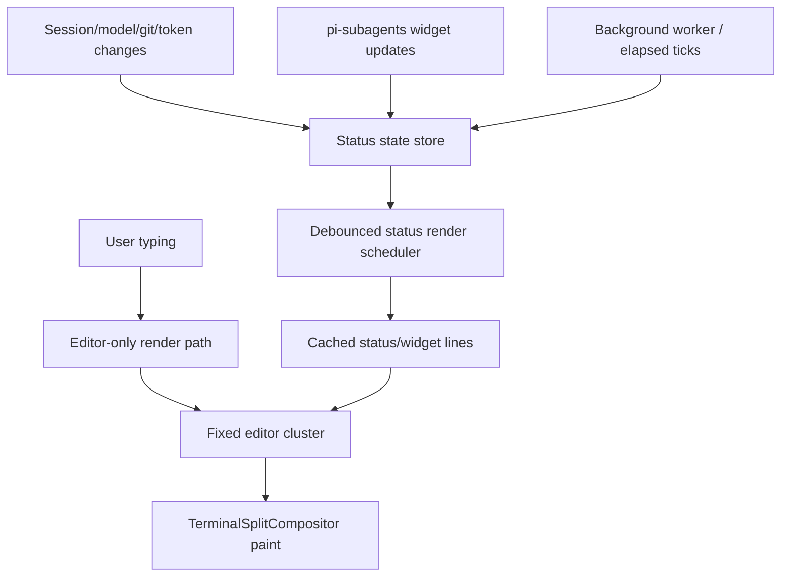

# refactor: Decouple Fixed Editor Status Rendering

## Summary

Decouple the pi-coder-theme fixed input editor from session/status/subagent display so typing remains responsive while background status remains live. The best path is to mirror the proven pi-powerline-footer model: cache expensive status layout, debounce status repaints, keep editor rendering pure, and only pursue lower-level partial repaint if the first pass is insufficient.

---

## Problem Frame

The current fixed editor compositor makes the input box, session data, and pi-subagents async widget share the same repaint path. pi-subagents updates its async widget from a 250ms poll loop with render-key de-duplication, but once pi-coder-theme hides that widget and embeds it in the fixed editor cluster, each visible async update can force hidden rendering of the widget, editor, status, git/session data, and cluster repaint together.

---

## Requirements

- R1. Preserve the fixed input editor UX while removing avoidable typing lag during active subagent/background work.
- R2. Keep session/status information visible, including model, context, token/cost, git, elapsed time, background worker, and extension statuses.
- R3. Avoid making pi-subagents appear broken or stale; async status may be throttled but should remain clearly live.
- R4. Keep rendering changes testable with unit coverage for scheduler/cache/compositor behavior.
- R5. Maintain existing Pi extension APIs and user-facing configuration unless explicitly adding an opt-in compatibility setting.
- R6. Prove the responsiveness improvement with observable render-path checks: typing should not recompute status layout, async widget updates should not invoke editor-only rendering, and unchanged clusters should not emit redundant terminal paint payloads.

---

## Scope Boundaries

- Do not rewrite pi-subagents or depend on private changes to its implementation.
- Do not replace the full fixed editor compositor in the first pass.
- Do not add new visual features while fixing responsiveness.
- Do not optimize unrelated thinking-step or user-message rendering unless a test proves it is on the same hot path.

### Deferred to Follow-Up Work

- True row-level partial repaint inside the fixed compositor: defer unless logical decoupling plus caching still leaves visible lag.
- A user-facing performance preset: defer until the default behavior is stable enough to expose as configuration.

---

## Context & Research

### Relevant Code and Patterns

- `extensions/pi-coder-theme-editor.ts` currently combines editor rendering with session/status labels and installs `TerminalSplitCompositor`.
- `extensions/fixed-editor/terminal-split.ts` intercepts `terminal.write`, rewrites `tui.render`, hides editor/status/widget renderables, and repaints a bottom cluster.
- `extensions/fixed-editor/cluster.ts` already accepts separate `statusLines`, `editorLines`, and `secondaryLines`, making logical section separation straightforward.
- `extensions/pi-coder-theme-git-budget.test.ts` and `extensions/fixed-editor/terminal-split.test.ts` provide existing test patterns for render-budget and compositor behavior.

### Institutional Learnings

- No `docs/solutions/` entries exist in this repository.

### External References

- `nicobailon/pi-powerline-footer`: uses `createRenderScheduler`, layout caching, typing deferral, async git status, and a footer shim that returns no lines while rendering status inside the fixed cluster.
- `nicobailon/pi-subagents`: async widget uses `POLL_INTERVAL_MS = 250`, `widgetRenderKey(job)` change detection, `ctx.ui.setWidget(WIDGET_KEY, ...)`, and `ctx.ui.requestRender?.()` only when visible job state changes.

---

## Key Technical Decisions

- Separate editor text rendering from status/session layout: editor render should not compute git, token/cost, context, elapsed, or background worker labels.
- Keep pi-subagents updates event-compatible: consume the existing widget output, keep it fixed in the bottom cluster through a cached widget snapshot, and prevent it from forcing editor status recomputation or editor hidden-render work.
- Add a small render scheduler instead of a high-frequency interval: status changes should be debounced and typing should temporarily defer non-critical status recomputation.
- Cache visible status layout by width and dirty state: repeated transcript writes should reuse the last status lines when nothing meaningful changed.
- Use explicit dirty reasons between the status scheduler, widget snapshot, and compositor cache so cache invalidation is observable and testable rather than implicit in global render calls.
- Start with logical decoupling, not compositor row-level partial repaint: this delivers most of the benefit with lower terminal-state risk.

---

## Open Questions

### Resolved During Planning

- Should pi-subagents be changed? No. Its rendering is already state-driven and de-duplicated; pi-coder-theme should adapt around it.
- Should status and input be separated? Yes. Logical separation is the best first fix; physical partial repaint is optional follow-up.
- Should the pi-subagents async widget remain visually fixed? Yes. Preserve the current fixed-bottom behavior by reading the widget through a cached snapshot; only fall back to Pi's normal widget path as an implementation safety valve if fixed snapshotting proves incompatible.

### Deferred to Implementation

- Exact cache key shape for status layout: finalize while adding tests around known invalidation cases.

---

## High-Level Technical Design

> *This illustrates the intended approach and is directional guidance for review, not implementation specification. The implementing agent should treat it as context, not code to reproduce.*

Core rule: editor input changes repaint immediately; status/session/subagent changes update cached status/widget lines on a controlled schedule. Dirty reasons flow into the compositor explicitly (`editor`, `status`, `widget`, `resize`, `overlay`, `selection`) so the final cluster may still combine sections for painting without coupling section computation.

---

## Implementation Units

### U1. Introduce status render state and scheduler

**Goal:** Add a small status render state layer that owns dirty flags, cached status/widget lines, and debounced repaint scheduling.

**Requirements:** R1, R2, R4, R6

**Dependencies:** None

**Files:**
- Create: `extensions/fixed-editor/status-render-scheduler.ts`
- Test: `extensions/fixed-editor/status-render-scheduler.test.ts`
- Modify: `extensions/pi-coder-theme-editor.ts`

**Approach:**
- Model the scheduler after pi-powerline-footer's one-shot debounce scheduler rather than an always-running interval.
- Track `lastEditorInputAt` and defer non-critical status recomputation briefly after input.
- Expose explicit methods for marking status dirty, marking widget dirty, forcing immediate status refresh, and cancelling timers on shutdown.
- Emit a typed dirty reason when the scheduler requests repaint so the compositor can invalidate the matching cache section without treating every update as a full editor change.

**Patterns to follow:**
- `pi-powerline-footer/render-scheduler.ts` for one-shot scheduling.
- Existing timer cleanup style in `extensions/pi-coder-theme-editor.ts`.

**Test scenarios:**
- Happy path: multiple status invalidations inside the debounce window schedule only one render callback.
- Edge case: typing within the editor defer window delays status recompute but does not drop it.
- Error path: cancelling the scheduler prevents pending callbacks from firing after shutdown.
- Integration: forced refresh bypasses the normal delay for state changes that must appear immediately.
- Integration: status and widget invalidations produce distinct dirty reasons that downstream compositor tests can assert independently.

**Verification:**
- Scheduler behavior is deterministic under fake timers and all timers are cleaned up by session shutdown.

---

### U2. Extract session/status layout from the editor render path

**Goal:** Make `PiCoderThemeEditor.render()` responsible for editor chrome only, moving model/context/git/token/cost/elapsed/background worker labels into a separate status layout builder.

**Requirements:** R1, R2, R4, R6

**Dependencies:** U1

**Files:**
- Create: `extensions/fixed-editor/status-layout.ts`
- Test: `extensions/fixed-editor/status-layout.test.ts`
- Modify: `extensions/pi-coder-theme-editor.ts`
- Modify: `extensions/pi-coder-theme-git-budget.test.ts`

**Approach:**
- Extract label builders from `PiCoderThemeEditor` into a status layout module that accepts a snapshot of session/status state.
- Cache token/cost/session usage for a short TTL so long sessions do not rescan entries on every render burst.
- Keep git data behind the existing budget/cache initially, then make invalidation explicit where the editor already receives relevant events.
- Ensure editor render no longer calls session usage, git collection, or `Date.now()` for status labels.

**Patterns to follow:**
- Existing `formatAgentElapsedTime`, `formatTokenUsage`, and git budget tests.
- pi-powerline-footer's `getResponsiveLayout()` cache shape: width, timestamp, dirty flag, and streaming-aware TTL.

**Test scenarios:**
- Happy path: a status snapshot renders the same visible labels as the current editor status line.
- Edge case: narrow widths still truncate left/right labels without exceeding terminal width.
- Edge case: repeated renders within the cache TTL reuse token/cost results.
- Error path: missing context/model/git data produces safe fallback labels without throwing.
- Integration: editor render does not invoke git/session usage helpers after extraction.
- Integration: typing-triggered editor renders reuse the cached status layout and do not increment status-layout recomputation counters.

**Verification:**
- Existing editor tests continue to pass, and new tests prove status computation is isolated from editor typing renders.

---

### U3. Decouple pi-subagents widget updates from editor input rendering

**Goal:** Prevent pi-subagents async widget updates from forcing hidden rendering of the editor status/session path on every 250ms state change.

**Requirements:** R1, R3, R4, R5, R6

**Dependencies:** U1, U2

**Files:**
- Modify: `extensions/pi-coder-theme-editor.ts`
- Modify: `extensions/fixed-editor/cluster.ts`
- Test: `extensions/pi-coder-theme.test.ts`
- Test: `extensions/fixed-editor/terminal-split.test.ts`

**Approach:**
- Treat the widget above the editor as a separate status/widget section instead of part of editor rendering.
- Preserve fixed visual placement by default: read the pi-subagents widget into a cached widget snapshot and feed that snapshot into the cluster independently from editor lines.
- Keep a narrow safety fallback that leaves the widget in Pi's normal widget path only if the fixed snapshot cannot be rendered safely; this should be an implementation fallback, not the default UX.
- Add a clear internal boundary for `statusLines`, `widgetLines`, `editorLines`, and `secondaryLines` so future partial repaint can target sections without another architectural split.

**Patterns to follow:**
- pi-subagents `renderWidget()` contract: it owns `ctx.ui.setWidget(WIDGET_KEY, ...)` and requests render only when `widgetRenderKey()` changes.
- pi-powerline-footer's `renderPowerlineStatusLines`, `renderPowerlineTopLines`, and `renderPowerlineSecondaryLines` separation.

**Test scenarios:**
- Happy path: async widget lines can update while editor text stays unchanged and editor render count does not increase unnecessarily.
- Happy path: pi-subagents widget remains visually fixed in the bottom cluster when fixed snapshot rendering succeeds.
- Edge case: no widget above editor still produces the same fixed editor cluster as before.
- Edge case: multiple widget lines are truncated/capped without pushing the editor off-screen.
- Integration: subagent widget removal clears the widget section without leaving stale lines in the fixed cluster.

**Verification:**
- Simulated widget updates repaint status/widget content without recomputing editor-only content beyond the necessary final cluster composition.
- Tests demonstrate that widget dirty events invalidate widget snapshot/cache state without calling the editor-only render path.

---

### U4. Replace high-frequency working timer with state-aware status ticks

**Goal:** Remove the 160ms global working timer as a source of full render pressure while keeping visible activity feedback.

**Requirements:** R1, R2, R3, R6

**Dependencies:** U1, U2

**Files:**
- Modify: `extensions/pi-coder-theme-editor.ts`
- Test: `extensions/pi-coder-theme.test.ts`

**Approach:**
- Move elapsed-time refresh to a 1000ms status tick because visible elapsed labels only change once per second.
- Reduce spinner cadence or derive the spinner from status update state instead of forcing independent full renders.
- Only schedule ticks while there is an active agent execution, active subagent timing, or active background worker state.

**Patterns to follow:**
- pi-subagents spinner seeding from changing progress state rather than independent animation timers.
- Existing `startWorkingTimer` / `stopWorkingTimer` lifecycle cleanup.

**Test scenarios:**
- Happy path: active work starts status ticks and session shutdown stops them.
- Edge case: completed elapsed time remains visible without continuing an active interval.
- Edge case: active background worker with no parent agent still refreshes elapsed display at second cadence.
- Error path: repeated start calls do not create duplicate timers.

**Verification:**
- No 160ms full-render interval remains; visible elapsed labels update at second granularity.

---

### U5. Add compositor-level cache guards for unchanged clusters

**Goal:** Avoid terminal writes when final fixed cluster content is unchanged, and reduce recomputation during transcript streaming.

**Requirements:** R1, R4, R5, R6

**Dependencies:** U2, U3, U4

**Files:**
- Modify: `extensions/fixed-editor/terminal-split.ts`
- Test: `extensions/fixed-editor/terminal-split.test.ts`

**Approach:**
- Preserve the existing paint-key guard, but add a render-side cache so repeated `getCluster(width, rows)` calls during the same render/write burst can reuse section output.
- Add an explicit invalidation seam from the scheduler/widget snapshot layer into `TerminalSplitCompositor`, with dirty reasons for editor input, status layout dirty, widget dirty, resize, overlay visibility changes, and selection changes.
- Invalidate cached cluster output through that seam rather than relying on incidental `requestRender()` calls to imply what changed.
- Keep the current synchronized output and scroll-region behavior unchanged to minimize terminal-state risk.

**Patterns to follow:**
- Existing `renderPassCluster` cache in `TerminalSplitCompositor`.
- Current `clusterPaintKey()` behavior for final paint de-duplication.

**Test scenarios:**
- Happy path: repeated writes with unchanged cluster content do not emit additional cluster paint payloads.
- Happy path: a status-only dirty reason refreshes cached status/widget lines without invoking editor-only render.
- Edge case: terminal width/row changes invalidate the cache and repaint at the new size.
- Edge case: cursor movement or selection changes invalidate only the required cluster state.
- Integration: overlay visibility bypasses fixed-cluster rendering as before.

**Verification:**
- Existing fixed-editor behavior is preserved while unchanged clusters avoid redundant render/paint work.

---

### U6. Validate package behavior and document performance intent

**Goal:** Update validation coverage and lightweight documentation so future changes do not re-couple status and input rendering.

**Requirements:** R1, R4, R5, R6

**Dependencies:** U1, U2, U3, U4, U5

**Files:**
- Modify: `README.md`
- Modify: `CHANGELOG.md`
- Modify: `package.json` only if new test helpers require script changes
- Test: existing test suite under `extensions/**/*.test.ts`

**Approach:**
- Document the fixed editor performance model briefly: editor input is immediate, status/widget rendering is cached and debounced.
- Add regression notes to tests rather than broad user-facing configuration unless implementation proves a toggle is necessary.

**Patterns to follow:**
- Existing README feature descriptions and CHANGELOG style.
- Existing `npm run typecheck`, `npm test`, and `npm run check` validation expectations.

**Test scenarios:**
- Test expectation: none -- this unit is documentation and validation packaging; behavioral coverage is carried by U1-U5.

**Verification:**
- Documentation accurately describes the new rendering model and the package still loads through the standard Pi check.

---

## System-Wide Impact

- **Interaction graph:** pi-subagents continues publishing widgets through Pi UI; pi-coder-theme changes how those widget lines are incorporated into fixed editor rendering.
- **Error propagation:** status render failures should fall back to the previous safe empty/status behavior rather than breaking editor input.
- **State lifecycle risks:** timers, dirty-reason queues, widget snapshots, and caches must clear on `session_shutdown` to avoid stale contexts after Pi reloads or session replacement.
- **API surface parity:** no public Pi extension API changes are planned.
- **Integration coverage:** compositor tests should simulate widget/status/editor update interleavings because unit tests for layout alone will not catch repaint coupling.
- **Unchanged invariants:** fixed editor scroll-region management, mouse scrolling, copy selection, command palette suppression, and overlay bypass behavior should remain unchanged.

---

## Risks & Dependencies

| Risk | Mitigation |
|------|------------|
| Fixed editor terminal state regresses | Keep terminal-split control sequences unchanged in the first pass; focus on cache/scheduler boundaries. |
| Status feels stale | Use visible-state dirty flags and second-level elapsed ticks; force refresh for model/thinking/session changes. |
| Subagent widget no longer appears fixed | Preserve fixed placement through the cached widget snapshot by default; use the normal-widget fallback only as an implementation safety valve. |
| Cache invalidation bugs hide updates | Route all invalidation through typed dirty reasons and add targeted tests for width, typing, widget change, status dirty, overlay, and shutdown invalidation. |

---

## Documentation / Operational Notes

- Manual verification should include an active async pi-subagents run, typing into the input while the widget updates, and comparing perceived latency before/after.
- Automated verification should prefer render-path counters and terminal-write assertions over wall-clock timing so the responsiveness proof is stable in CI.
- Package validation should include typecheck, tests, Pi load check, and package dry-run if documentation/package files change.

---

## Sources & References

- Related code: `extensions/pi-coder-theme-editor.ts`
- Related code: `extensions/fixed-editor/terminal-split.ts`
- Related code: `extensions/fixed-editor/cluster.ts`
- Related tests: `extensions/fixed-editor/terminal-split.test.ts`
- Related tests: `extensions/pi-coder-theme-git-budget.test.ts`
- External reference: https://github.com/nicobailon/pi-powerline-footer
- External reference: https://github.com/nicobailon/pi-subagents
