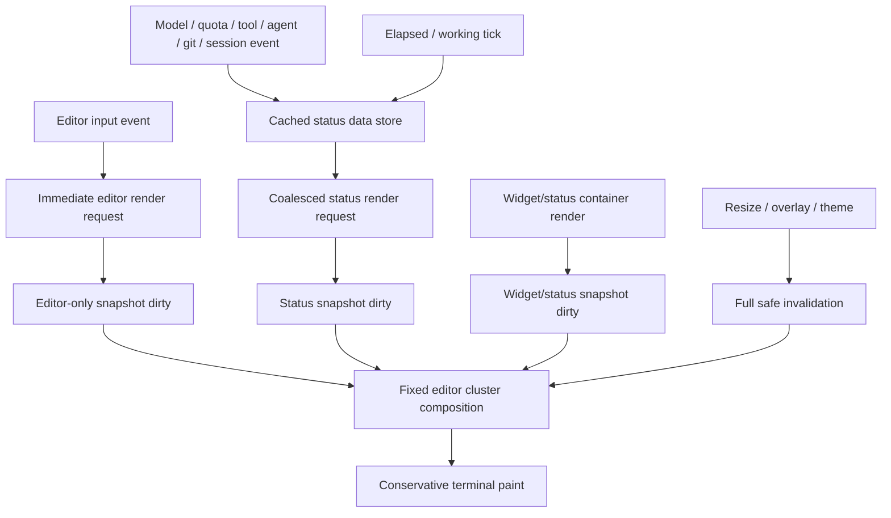

# refactor: Fixed Editor Render Performance Safety Pass

## Summary

Plan a second performance pass for the fixed editor after the initial status-rendering decoupling work. The goal is to remove remaining UI-thread stalls and duplicate render triggers while preserving Pi's TUI contract: editor input must repaint immediately, status/widget updates may be gently coalesced, and terminal scroll/cursor behavior must remain stable.

---

## Problem Frame

The current implementation already introduced status layout caching, dirty reasons, and fixed-cluster repaint throttling, but review found several remaining hot-path risks. High-frequency working/status ticks can still force full status recomputation; editor input can trigger redundant render paths; status-only updates can still mark editor snapshots dirty; and terminal-write changes carry high regression risk if optimized too aggressively.

The user explicitly prioritized avoiding render regressions: no delayed typing, no stale fixed editor, no scroll/cursor corruption, and no new source of perceived lag.

---

## Requirements

- R1. Preserve immediate editor input rendering: typed text, cursor position, command palette entry, IME cursor placement, and editor popup behavior must not be debounced behind status work.
- R2. Remove synchronous or O(session-history) work from high-frequency render paths so status ticks and streaming output cannot block the TUI thread.
- R3. Keep status and widget information live enough to feel responsive while allowing non-critical fields such as git, token usage, cost, quota, and elapsed time to update from cached snapshots.
- R4. Prevent status-only dirty events from invalidating editor-only snapshots unless visible editor content actually changed.
- R5. Preserve fixed-editor terminal invariants: scroll region, hardware cursor visibility, synchronized output, overlay bypass, selection, mouse scrolling, and resize behavior remain correct.
- R6. Add regression tests that prove the optimization improves render-path behavior without making updates stale or delayed.
- R7. Keep the public Pi extension behavior and package configuration compatible; no new user-facing setting unless implementation proves it is necessary for rollback.

---

## Scope Boundaries

- Do not rewrite `TerminalSplitCompositor` or replace the fixed-editor architecture in this pass.
- Do not aggressively batch or reorder terminal writes until higher-level render invalidation has been fixed and tested.
- Do not change pi-subagents behavior or require private changes to that package.
- Do not remove visible status fields; instead, change how and when expensive fields are recomputed.
- Do not optimize unrelated thinking-step or user-message rendering unless tests prove it is coupled to the same fixed-editor hot path.

### Deferred to Follow-Up Work

- Row-level partial repaint inside `TerminalSplitCompositor`: defer unless this pass still leaves visible lag after render invalidation is fixed.
- Aggressive terminal control-sequence minimization: defer to a dedicated compositor safety pass because it can corrupt scroll/cursor state.
- A user-facing performance preset or compatibility toggle: defer until there is evidence that default-safe behavior is insufficient.

---

## Context & Research

### Relevant Code and Patterns

- `extensions/pi-coder-theme-editor.ts` owns the custom editor, status layout construction, working timers, event subscriptions, quota refresh, git/session aggregation, and fixed compositor installation.
- `extensions/fixed-editor/status-render-scheduler.ts` currently flushes editor input immediately and coalesces other dirty reasons.
- `extensions/fixed-editor/status-layout.ts` contains status layout helpers and a width/TTL cache, but the cache is invalidated on many status events and still wraps expensive builders.
- `extensions/fixed-editor/terminal-split.ts` owns terminal interception, fixed cluster rendering, dirty-reason invalidation, scroll-region management, selection, overlay bypass, and repaint throttling.
- `extensions/fixed-editor/cluster.ts` already separates status, widget, editor, and secondary lines, which is the right boundary for safer caching.
- `extensions/fixed-editor/status-render-scheduler.test.ts`, `extensions/fixed-editor/status-layout.test.ts`, `extensions/fixed-editor/terminal-split.test.ts`, and `extensions/pi-coder-theme-git-budget.test.ts` provide the strongest existing regression-test footholds.
- Existing plan `docs/plans/2026-05-21-001-refactor-decouple-fixed-editor-status-rendering-plan.md` completed the first decoupling pass; this plan focuses on remaining risks discovered after reviewing that implementation.

### Institutional Learnings

- No `docs/solutions/` directory exists in this repository, so there are no local solution write-ups to carry forward.

### Pi/TUI Contract References

- Pi extension docs confirm `ctx.ui.setEditorComponent`, `ctx.ui.setFooter`, `ctx.ui.setWidget`, lifecycle cleanup on `session_shutdown`, and `requestRender()` as the normal UI invalidation mechanism.
- Pi TUI docs require rendered component lines to stay within width, custom components to invalidate caches on theme changes, and state-changing input handlers to request render so UI changes are visible.
- Pi TUI docs also highlight `CustomEditor` and focus/cursor behavior; this plan must preserve immediate input render and hardware cursor placement rather than treating editor input like ordinary status refresh.
- Official examples show simple footer/widget/working-indicator patterns but also demonstrate that naive footer renderers can compute token/cost data during render; this package needs stronger caching because it embeds those labels in a high-frequency fixed cluster.

### External References

- No web research is needed for this pass. The risk is repository-specific TUI render coupling, and the relevant contracts are covered by local Pi docs and existing code.

---

## Key Technical Decisions

- Treat editor input as a high-priority render lane: editor text/cursor/popup updates may request render immediately, but that request must not automatically recompute slow status fields.
- Treat status data as snapshot-driven: token/cost/git/quota/model labels should be recomputed by explicit event or TTL refresh and read synchronously from memory during render.
- Split dirty semantics by visible surface: editor, status, widget, resize, overlay, and selection dirty reasons must invalidate only the caches they own, with resize and overlay remaining full-invalidation cases.
- Keep terminal-write behavior conservative: this plan may add assertions around existing no-op repaint behavior, but it should not remove scroll-region or synchronized-output safeguards in the first fix wave.
- Prefer render-count and helper-call assertions over wall-clock performance tests; they are more stable and directly prove the coupling is gone.
- Make status freshness explicit: dynamic display fields can update on controlled ticks, while fields that do not visibly change every frame should never be recomputed by every spinner frame or streaming write.

---

## Open Questions

### Resolved During Planning

- Should this update the completed first-pass plan? No. The user confirmed a new phase-two plan so the completed artifact remains historical and this plan can focus on residual risk.
- Should terminal-write control-sequence optimization be in the first batch? No. It is high risk for scroll/cursor regressions and should remain deferred unless lower-risk fixes fail to remove the lag.
- Should editor input be debounced? No. Only redundant secondary work should be coalesced; input text and cursor updates must remain immediate.

### Deferred to Implementation

- Exact cache object boundaries for session usage: finalize while adding tests around event-driven updates and long-session behavior.
- Exact status freshness TTLs for git/token/cost/quota: choose conservative defaults during implementation and prove visible fields update from cached snapshots rather than render-time scans.
- Whether existing tests need a small test-only introspection seam for render counters: decide during implementation; prefer injecting counters into existing factories over exposing runtime API.

---

## High-Level Technical Design

> *This illustrates the intended approach and is directional guidance for review, not implementation specification. The implementing agent should treat it as context, not code to reproduce.*

Render-lane rule:

| Event type | May repaint immediately? | May recompute expensive status data? | Required safety behavior |
|------------|--------------------------|--------------------------------------|--------------------------|
| Editor typing/cursor movement | Yes | No | Text/cursor must update immediately from cached status snapshot |
| Command palette/editor popup | Yes | No | Popup remains attached to editor render path |
| Working spinner/elapsed tick | Coalesced except visible tick boundary | No session/git scans | Updates label from cached or lightweight time state |
| Git/token/cost/quota refresh | Coalesced | Yes, outside render path | Render reads latest completed snapshot |
| Widget update | Coalesced unless placement changes | No editor recompute | Widget cache invalidates independently |
| Resize/theme/overlay | Yes/full | Rebuild visible layout safely | Clear relevant caches and preserve terminal invariants |

---

## Implementation Units

### U1. Add performance-safety regression harnesses around current hot paths

**Goal:** Establish reusable characterization harnesses and baseline assertions for render coupling before changing behavior.

**Requirements:** R1, R2, R4, R5, R6

**Dependencies:** None

**Files:**
- Modify: `extensions/fixed-editor/status-render-scheduler.test.ts`
- Modify: `extensions/fixed-editor/status-layout.test.ts`
- Modify: `extensions/fixed-editor/terminal-split.test.ts`
- Modify: `extensions/pi-coder-theme-git-budget.test.ts`
- Modify: `extensions/pi-coder-theme-stale-context.test.ts`

**Approach:**
- Add test helpers and safe characterization coverage for input-triggered renders, status-triggered renders, working ticks, and unchanged terminal writes.
- Assert behavior through render counts, helper-call counts, dirty-reason propagation, and terminal payload content rather than wall-clock timing.
- Capture current behavior where it is already safe; for known-bad behavior, add the failing desired-behavior assertion in the implementation unit that fixes it so each unit can land with passing tests.
- Keep these tests close to the existing test files so implementation can evolve internals without creating a separate benchmark harness.

**Execution note:** Use characterization-first coverage here, then add test-first desired-behavior assertions inside U2-U6 where the matching fix lands.

**Patterns to follow:**
- Existing fake timer usage in `extensions/fixed-editor/status-render-scheduler.test.ts`.
- Existing terminal payload assertions in `extensions/fixed-editor/terminal-split.test.ts`.
- Existing git budget mocks in `extensions/pi-coder-theme-git-budget.test.ts`.

**Test scenarios:**
- Happy path: typing calls the editor render path promptly while status recompute helpers are not invoked in the same input-triggered render.
- Happy path: a status-only dirty event schedules one coalesced render and does not mark editor-only snapshot state dirty.
- Happy path: repeated terminal writes with unchanged fixed cluster content avoid additional cluster paint payloads.
- Edge case: resize invalidates all snapshots and repaints with the new dimensions.
- Edge case: overlay visibility bypasses fixed-cluster rendering as before.
- Integration: active working/subagent ticks update visible status labels without re-running git/session usage aggregation.

**Verification:**
- Test helpers and baseline assertions are in place without requiring the repository to carry intentionally failing tests between units.

---

### U2. Move session usage, cost, and git aggregation out of render-time layout construction

**Goal:** Ensure `PiCoderThemeEditor.render()` and fixed-cluster composition read precomputed snapshots instead of synchronously scanning session history or running git commands.

**Requirements:** R2, R3, R6, R7

**Dependencies:** U1

**Files:**
- Modify: `extensions/pi-coder-theme-editor.ts`
- Modify: `extensions/fixed-editor/status-layout.ts`
- Modify: `extensions/fixed-editor/status-layout.test.ts`
- Modify: `extensions/pi-coder-theme-git-budget.test.ts`
- Test: `extensions/pi-coder-theme-stale-context.test.ts`

**Approach:**
- Introduce a small status data snapshot layer for expensive fields: token usage, cost, subscription state, git summary, quota, model/context metadata, and extension status label.
- Update snapshots from lifecycle events, explicit refresh timers, or bounded asynchronous/scheduled work rather than from the status layout builder.
- Keep render-time layout construction pure and cheap: it should format already-available values, not collect them.
- Preserve the current git budget behavior for the refresh operation, but make render paths read the most recent snapshot even when refresh is pending.
- Treat stale non-critical values as acceptable within the chosen freshness window; never block typing or streaming output on refreshing them.

**Patterns to follow:**
- Existing `GIT_CACHE_MS`, workspace git budget helpers, and quota refresh chain in `extensions/pi-coder-theme-editor.ts`.
- Pi docs' guidance to use lifecycle events and cleanup on `session_shutdown` for extension state.
- Existing status layout helpers in `extensions/fixed-editor/status-layout.ts`.

**Test scenarios:**
- Happy path: rendering the editor twice after session start formats token/cost/git labels from cached status data without rescanning session entries or invoking git again.
- Happy path: an agent/message lifecycle event refreshes token/cost snapshots and a later render shows the new totals.
- Edge case: a git refresh timeout leaves the previous snapshot visible and does not block render.
- Edge case: missing model, missing usage, or non-git workspace produces safe fallback labels from the snapshot layer.
- Error path: exceptions while collecting git/session data are swallowed into fallback snapshots and do not prevent editor rendering.
- Integration: working tick refreshes elapsed/spinner text without invoking git, token, or cost collectors.

**Verification:**
- Render-path tests prove expensive collectors are not called from `PiCoderThemeEditor.render()` or status layout cache builders.

---

### U3. Make editor input invalidation immediate but single-pass

**Goal:** Remove duplicate input-triggered render requests while preserving immediate visible typing, cursor, popup, and IME behavior.

**Requirements:** R1, R4, R6

**Dependencies:** U1, U2

**Files:**
- Modify: `extensions/pi-coder-theme-editor.ts`
- Modify: `extensions/fixed-editor/status-render-scheduler.ts`
- Modify: `extensions/fixed-editor/status-render-scheduler.test.ts`
- Test: `extensions/pi-coder-theme-command-palette.test.ts`
- Test: `extensions/pi-coder-theme-stale-context.test.ts`

**Approach:**
- Separate `markEditorInput` into two concepts: editor snapshot dirtiness and render scheduling.
- Let the actual editor input path request the immediate render needed for text/cursor changes, but prevent the wrapper and the explicit `handleInput` tail from both causing independent flushes for the same keystroke.
- Adjust scheduler semantics so editor input records `lastEditorInputAt` for deferring non-critical status refresh, without turning every input mark into an additional status render.
- Preserve command palette insertion/submission behavior and any editor popup rendering that relies on `CustomEditor` internals.

**Patterns to follow:**
- Pi TUI docs: state-changing input handlers should request render so UI changes are visible.
- Pi TUI docs: `CustomEditor` should remain the base editor for app keybindings and focus behavior.
- Current command palette tests and editor factory test stubs.

**Test scenarios:**
- Happy path: typing visible text results in one immediate render request for the editor lane.
- Happy path: `markEditorInput` records the input time so later status dirty events defer briefly instead of competing with typing.
- Edge case: a key that does not change editor text does not trigger duplicate status recomputation.
- Edge case: `/` command palette open path remains immediate and does not leave stale editor text.
- Error path: if the wrapped TUI lacks `requestRender`, input handling does not throw.
- Integration: IME/hardware cursor marker remains controlled by the editor render output and is not delayed behind the status scheduler.

**Verification:**
- Input tests demonstrate immediate editor visibility and no duplicate render/scheduler flush for a single keystroke.

---

### U4. Prevent status-only updates from invalidating editor snapshots

**Goal:** Ensure working ticks, background worker updates, quota refreshes, git refreshes, and extension status changes update status/widget lines without forcing editor body recomputation.

**Requirements:** R3, R4, R6

**Dependencies:** U1, U2, U3

**Files:**
- Modify: `extensions/pi-coder-theme-editor.ts`
- Modify: `extensions/fixed-editor/status-layout.ts`
- Test: `extensions/fixed-editor/status-layout.test.ts`
- Test: `extensions/pi-coder-theme-stale-context.test.ts`
- Test: `extensions/fixed-editor/terminal-split.test.ts`

**Approach:**
- Rework dirty-reason handling so `status` invalidates status layout and cluster paint cache, but not editor snapshot content.
- Keep `editor` dirty for editor text, cursor, command palette/editor popup, and editor component invalidation.
- Keep `widget` dirty for hidden widget/status container snapshots, not editor body.
- Keep `resize`, `overlay`, and theme invalidation as full reset cases because layout and ANSI styling may have changed globally.
- Avoid changing `extensions/fixed-editor/cluster.ts` unless implementation proves the existing section names cannot express the dirty split; if that happens, treat it as a scoped addition to this unit and add the matching cluster test.
- Ensure status layout caching is field-aware enough that a spinner/elapsed change does not force a git/session snapshot refresh.

**Patterns to follow:**
- Existing dirty reason union in `extensions/fixed-editor/status-render-scheduler.ts`.
- Existing `onInvalidateCluster` seam in `TerminalSplitCompositor`.
- Pi TUI docs on clearing cached themed render output on invalidate.

**Test scenarios:**
- Happy path: status-only dirty updates the status row and leaves editor render count unchanged.
- Happy path: widget-only dirty updates cached widget lines and leaves editor text snapshot unchanged.
- Edge case: resize invalidates editor, status, widget, and secondary snapshots together.
- Edge case: theme/component invalidation rebuilds styled strings rather than reusing stale ANSI colors.
- Error path: a status builder failure falls back to the previous safe status snapshot or empty status without breaking editor rendering.
- Integration: active background worker status continues to animate or update while typing remains responsive.

**Verification:**
- Tests prove status/widget changes are visible but do not call editor-only render work unless an editor dirty reason was emitted.

---

### U5. Replace high-frequency full-refresh ticks with status-snapshot ticks

**Goal:** Keep activity indicators live without using a frequent interval that invalidates all status/editor rendering.

**Requirements:** R1, R2, R3, R4, R6

**Dependencies:** U2, U3, U4

**Files:**
- Modify: `extensions/pi-coder-theme-editor.ts`
- Modify: `extensions/fixed-editor/status-render-scheduler.ts` if timer semantics need a named tick method
- Test: `extensions/fixed-editor/status-render-scheduler.test.ts`
- Test: `extensions/pi-coder-theme-stale-context.test.ts`

**Approach:**
- Replace the current working interval's forced full status refresh with a lightweight status-snapshot tick that only updates dynamic fields such as spinner frame and elapsed label.
- Avoid recalculating git/token/cost on every activity tick; those fields should update from their own event/TTL refresh path.
- Schedule ticks only while agent work, subagent work, or background-worker status is active, and clean them up on `agent_end` and `session_shutdown`.
- Keep visible elapsed updates at a human-meaningful cadence; do not chase high-frame-rate animation if it increases render pressure.

**Patterns to follow:**
- Existing `startWorkingTimer` / `stopWorkingTimer` lifecycle cleanup.
- Official `working-indicator.ts` example for separating working indicator state from broad extension behavior.

**Test scenarios:**
- Happy path: before agent start begins a status tick and agent end stops it.
- Happy path: active subagent/background worker status keeps a status tick alive even after parent agent work ends.
- Edge case: repeated start calls do not create duplicate intervals.
- Edge case: completed elapsed state remains visible without an active interval.
- Error path: session shutdown cancels every pending tick and render scheduler timer.
- Integration: status tick changes the visible spinner/elapsed label without invoking expensive status snapshot refreshers.

**Verification:**
- No high-frequency full-refresh path remains; tick tests prove only lightweight status state is updated.

---

### U6. Harden compositor paint de-duplication without changing terminal-state semantics

**Goal:** Add safety around unchanged cluster repaints and trailing repaint scheduling while preserving scroll-region and cursor invariants.

**Requirements:** R5, R6, R7

**Dependencies:** U3, U4, U5

**Files:**
- Modify: `extensions/fixed-editor/terminal-split.ts`
- Test: `extensions/fixed-editor/terminal-split.test.ts`

**Approach:**
- Keep synchronized output, scroll-region setup/reset, cursor visibility handling, overlay bypass, and alternate-screen cleanup behavior unchanged unless a test demonstrates an existing bug.
- Strengthen existing paint-key tests to cover no-op repaint, changed-cluster repaint after throttle, resize repaint, selection repaint, and overlay bypass.
- If implementation changes are needed, prefer narrowing when cluster content is computed or painted over changing low-level terminal control semantics.
- Document the high-risk boundary in tests: no-op optimization must not remove the control sequences required to keep transcript output out of the fixed editor region.

**Patterns to follow:**
- Existing `buildClusterPaintIfChanged`, `clusterPaintKey`, `requestRepaint`, and trailing repaint tests.
- Pi TUI debug logging guidance via `PI_TUI_WRITE_LOG` for manual ANSI-stream inspection when needed.

**Test scenarios:**
- Happy path: unchanged cluster content during streaming does not repaint fixed editor lines repeatedly.
- Happy path: changed cluster content after the throttle window repaints exactly once.
- Edge case: resize invalidates the paint key and repaints the cluster at the new width/row count.
- Edge case: selection changes force repaint because highlighted text changes even if raw cluster lines are otherwise identical.
- Edge case: visible overlay prevents fixed-cluster repaint and restores normal rendering behavior.
- Error path: dispose clears pending trailing repaint timers and restores terminal write/doRender/render hooks.
- Integration: terminal writes during active fixed editor keep transcript output constrained to the scrollable region.

**Verification:**
- Terminal-split tests show improved de-duplication while scroll/cursor/overlay behavior remains unchanged.

---

### U7. Update documentation and release notes with the render safety model

**Goal:** Make the new performance model explicit so future changes do not reintroduce render coupling.

**Requirements:** R3, R5, R7

**Dependencies:** U1, U2, U3, U4, U5, U6

**Files:**
- Modify: `README.md`
- Modify: `CHANGELOG.md`
- Test: existing test suite under `extensions/**/*.test.ts`

**Approach:**
- Add a concise note that the fixed editor uses immediate editor rendering plus cached/coalesced status rendering.
- Document that non-critical status fields may refresh from snapshots while typing remains immediate.
- Avoid adding a user-facing configuration flag unless implementation reveals a compatibility need.

**Patterns to follow:**
- Existing README feature language and CHANGELOG release-note style.
- Repository guideline that extension behavior changes should be manually verified in Pi when practical.

**Test scenarios:**
- Test expectation: none -- this unit documents behavior; executable regression coverage is carried by U1-U6.

**Verification:**
- README/CHANGELOG accurately describe the user-visible performance intent without promising implementation details.

---

## System-Wide Impact

- **Interaction graph:** Pi editor input, footer/status updates, hidden widget rendering, terminal write interception, and fixed-cluster composition remain connected but get separate cache and invalidation lanes.
- **Error propagation:** status snapshot refresh failures should degrade to stale or empty non-critical labels, never to editor input failure.
- **State lifecycle risks:** session switches, reloads, and shutdown must clear intervals, scheduler timers, pending repaint timers, cached status data, widget snapshots, and editor snapshots.
- **API surface parity:** public package manifest, theme registration, extension registration, and user-facing configuration remain unchanged.
- **Integration coverage:** tests must cover interleavings between typing, active agent streaming, subagent/background worker updates, overlays, resize, and terminal writes.
- **Unchanged invariants:** `CustomEditor` keybindings, command palette behavior, fixed editor placement, mouse selection/copy, scrollback behavior, overlay suppression, and theme color invalidation remain intact.

---

## Risks & Dependencies

| Risk | Mitigation |
|------|------------|
| Typing feels delayed after scheduler changes | Preserve an immediate editor lane and add tests that assert input-visible render happens without waiting for status debounce. |
| Status appears stale or frozen | Use explicit snapshot refresh events and lightweight ticks for visible dynamic fields; add tests proving status-only updates still repaint. |
| Git/token/cost snapshots become inaccurate | Refresh from lifecycle events and bounded TTLs, but keep stale snapshot fallback instead of blocking render. |
| Dirty-reason split hides editor updates | Treat resize, overlay, theme, and explicit editor input as full/editor invalidation; add tests for each invalidation category. |
| Compositor optimization corrupts terminal state | Do not remove scroll-region/synchronized-output/cursor safeguards in this plan; only strengthen no-op repaint guards behind tests. |
| Tests overfit internal implementation | Prefer observable render counts, helper-call counters, dirty-reason effects, and terminal payload invariants over private object shape assertions. |

---

## Documentation / Operational Notes

- Manual verification should include typing while an assistant response streams, while subagent/background status changes, and while git status/token/cost labels are visible.
- Manual verification should include command palette open/insert/submit, overlay open/close, terminal resize, mouse selection/copy, and session shutdown/reload.
- If terminal behavior looks suspicious, use Pi TUI write logging to compare ANSI payloads before and after the compositor-safe unit.
- Package validation should include typecheck, unit tests, Pi load check, and package dry run when documentation/package contents change.

---

## Sources & References

- Previous plan: `docs/plans/2026-05-21-001-refactor-decouple-fixed-editor-status-rendering-plan.md`
- Related code: `extensions/pi-coder-theme-editor.ts`
- Related code: `extensions/fixed-editor/status-render-scheduler.ts`
- Related code: `extensions/fixed-editor/status-layout.ts`
- Related code: `extensions/fixed-editor/terminal-split.ts`
- Related code: `extensions/fixed-editor/cluster.ts`
- Related tests: `extensions/fixed-editor/status-render-scheduler.test.ts`
- Related tests: `extensions/fixed-editor/status-layout.test.ts`
- Related tests: `extensions/fixed-editor/terminal-split.test.ts`
- Related tests: `extensions/pi-coder-theme-git-budget.test.ts`
- Related tests: `extensions/pi-coder-theme-stale-context.test.ts`
- Pi docs: `docs/extensions.md` in the installed `@earendil-works/pi-coding-agent` package
- Pi docs: `docs/tui.md` in the installed `@earendil-works/pi-coding-agent` package
- Pi examples: `examples/extensions/custom-footer.ts` in the installed `@earendil-works/pi-coding-agent` package
- Pi examples: `examples/extensions/widget-placement.ts` in the installed `@earendil-works/pi-coding-agent` package
- Pi examples: `examples/extensions/working-indicator.ts` in the installed `@earendil-works/pi-coding-agent` package
- Pi examples: `examples/extensions/modal-editor.ts` in the installed `@earendil-works/pi-coding-agent` package
