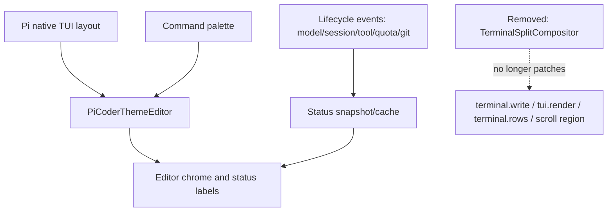

# refactor: Remove Fixed Editor Compositor

## Summary

Remove the fixed-bottom input-box feature from `pi-coder-theme` by deleting the terminal-split compositor path and returning to Pi's native editor/widget/footer flow. Keep the theme, rounded editor chrome, status labels, command palette, structured thinking, user-message rendering, and bundled tool display intact, but stop intercepting terminal writes, scroll regions, mouse events, and alternate-screen behavior.

---

## Problem Frame

The current fixed editor feature improves bottom anchoring but owns a high-risk terminal hot path: it patches `terminal.write`, rewrites `tui.render`, changes terminal row reporting, hides renderables, manages scroll regions, and repaints a synthetic bottom cluster during streaming output. If the user's priority is reducing perceived lag, the safest solution is to remove that interception layer entirely rather than keep optimizing it.

---

## Requirements

- R1. Completely remove the fixed-bottom editor behavior: the input editor should no longer be pinned by custom terminal scroll-region logic.
- R2. Preserve the rest of the package's value: theme colors, editor chrome, status labels, command palette, thinking-step display, compact user messages, and bundled `pi-tool-display`.
- R3. Stop patching private or fragile TUI/terminal internals for fixed rendering: no `terminal.write` override, no `terminal.rows` override, no alternate-screen/scroll-region compositor, no mouse-selection compositor.
- R4. Keep status rendering lightweight enough for the normal editor path; do not reintroduce git/session scans on every keystroke.
- R5. Remove or rewrite fixed-editor-specific tests so the suite describes the new behavior instead of preserving the removed feature.
- R6. Update documentation so users no longer expect a fixed bottom input box.

---

## Scope Boundaries

- Do not remove the `pi-coder-theme-dark` theme.
- Do not remove the custom editor chrome unless implementation proves it only exists to support fixed positioning.
- Do not remove structured thinking display, compact user message rendering, ChatGPT quota labels, git summary, elapsed-time status, or bundled `pi-tool-display`.
- Do not add a compatibility toggle for the old fixed editor; this plan intentionally removes the feature rather than hiding it behind config.
- Do not rewrite Pi's native TUI layout behavior.

### Deferred to Follow-Up Work

- A lighter optional bottom status/footer extension can be reconsidered later if users miss the fixed status row, but it should use public Pi APIs and not terminal interception.
- Performance benchmarking can be added later if subjective lag remains after removing the compositor.

---

## Context & Research

### Relevant Code and Patterns

- `extensions/pi-coder-theme-editor.ts` installs the custom editor, status layout, command palette, timers, quota refresh, and currently wires `TerminalSplitCompositor`.
- `extensions/fixed-editor/terminal-split.ts` is the fixed-bottom compositor and the primary removal target. It intercepts terminal writes, render calls, row calculations, scroll, mouse selection, cursor visibility, overlays, and repaint throttling.
- `extensions/fixed-editor/cluster.ts` exists to compose status/widget/editor/secondary lines into the fixed bottom cluster. Once the compositor is gone, this module should be removed.
- `extensions/fixed-editor/status-layout.ts` and `extensions/fixed-editor/status-render-scheduler.ts` are not inherently fixed-position features; they can be kept but should move to a neutral namespace if still used.
- Existing fixed-editor plans show two completed attempts to reduce compositor lag; this plan chooses removal instead of another optimization pass.

### Institutional Learnings

- No `docs/solutions/` directory exists in this repository.

### External References

- No external research is needed. The decision is repository-specific: remove a custom terminal compositor and rely on Pi's native rendering path.

---

## Key Technical Decisions

- Remove, do not toggle: the user's goal is to fully remove the fixed feature, so the implementation should not keep dormant compositor code behind a config flag.
- Keep editor status as normal editor chrome where possible: status labels should render through `PiCoderThemeEditor` and Pi's normal component lifecycle, not through a synthetic fixed cluster.
- Preserve status snapshot/caching logic if still useful: the performance issue is terminal interception, not the existence of cached status labels.
- Rename reusable status helpers away from `fixed-editor`: keeping non-fixed helpers under a `fixed-editor` directory would make the codebase misleading after removal.
- Let Pi own scrolling, selection, overlays, cursor, and terminal rows again: this removes the riskiest private TUI coupling.
- Return embedded widget/footer content to Pi-native behavior: widgets should no longer be hidden and embedded in the fixed cluster; retain a no-op footer only if it is still needed to receive `footerData` for extension status labels.

---

## Open Questions

### Resolved During Planning

- Should the old fixed behavior remain behind a config flag? No. The requested direction is complete removal.
- Should terminal-split be partially retained for mouse selection or scroll restoration? No. Those behaviors exist only to support the custom fixed viewport and should be removed with it.
- Should status-layout caching be deleted too? Not automatically. It should be retained or renamed if the normal editor still uses it to avoid expensive render-time work.

### Deferred to Implementation

- Exact final module names for retained status helpers: choose during implementation based on the smallest clean rename surface, likely `extensions/editor-status/` or `extensions/editor-chrome/`.
- Whether all fixed-editor tests are deleted or some are rewritten around the normal editor path: decide while updating tests.

---

## High-Level Technical Design

> *This illustrates the intended approach and is directional guidance for review, not implementation specification. The implementing agent should treat it as context, not code to reproduce.*

The new rule is simple: Pi owns the terminal viewport. `pi-coder-theme` only supplies normal Pi components and formatting.

---

## Implementation Units

### U1. Remove fixed compositor installation from editor extension

**Goal:** Stop creating, installing, suppressing, invalidating, and disposing the fixed editor compositor from the main extension.

**Requirements:** R1, R2, R3, R4

**Dependencies:** None

**Files:**
- Modify: `extensions/pi-coder-theme-editor.ts`
- Test: `extensions/pi-coder-theme.test.ts`
- Test: `extensions/pi-coder-theme-stale-context.test.ts`
- Test: `extensions/pi-coder-theme-command-palette.test.ts`

**Approach:**
- Remove `TerminalSplitCompositor` and `renderFixedEditorCluster` imports.
- Remove compositor state variables, container discovery, hidden-render snapshots, `installFixedEditorCompositor`, `teardownFixedEditorCompositor`, and command-palette suppression logic tied to the compositor.
- Keep `ui.setEditorComponent` and the custom `PiCoderThemeEditor` registration.
- Keep status refresh scheduling only where it still feeds normal editor rendering.
- Treat `ui.setFooter` as a data-source decision, not a layout decision: remove it if it only existed to trigger compositor installation, but keep a no-op footer if `footerData.getExtensionStatuses()` is still required for model/status labels.
- Stop hiding the widget containers that were previously embedded into the fixed cluster; after removal, Pi-native widget placement is the expected behavior.

**Patterns to follow:**
- Existing `ui.setEditorComponent` usage in `extensions/pi-coder-theme-editor.ts`.
- Existing command palette tests for overlay behavior without relying on terminal-split suppression.

**Test scenarios:**
- Happy path: session start registers the custom editor and does not create or install any terminal compositor.
- Happy path: typed input still renders with theme text color and rounded editor chrome.
- Happy path: command palette opens and restores editor behavior without fixed-cluster suppression.
- Happy path: widget/footer content previously embedded in the fixed cluster either renders through Pi's native placement or is intentionally absent because the source component was removed.
- Edge case: session shutdown cleans timers and state without needing compositor disposal.
- Integration: status invalidation requests a normal Pi render but does not patch terminal internals.

**Verification:**
- No runtime path in `pi-coder-theme-editor.ts` references `TerminalSplitCompositor`, `renderFixedEditorCluster`, hidden renderables, scroll-region suppression, or fixed cluster repaint.

---

### U2. Move retained status helpers out of the fixed-editor namespace

**Goal:** Keep useful status layout and scheduling code while removing the misleading fixed-editor architecture boundary.

**Requirements:** R2, R4, R5

**Dependencies:** U1

**Files:**
- Move/modify: `extensions/fixed-editor/status-layout.ts`
- Move/modify: `extensions/fixed-editor/status-render-scheduler.ts`
- Move/modify: `extensions/fixed-editor/status-layout.test.ts`
- Move/modify: `extensions/fixed-editor/status-render-scheduler.test.ts`
- Modify: `extensions/pi-coder-theme-editor.ts`

**Approach:**
- Rename the retained modules to a neutral directory such as `extensions/editor-status/` or `extensions/editor-chrome/`.
- Update imports and test imports.
- Keep the cache/scheduler behavior only if it still protects normal editor rendering from expensive status recomputation.
- Remove fixed-cluster dirty reasons that only made sense for the compositor, or rename them to normal editor/status refresh concepts.

**Patterns to follow:**
- Existing `StatusLayoutCache` tests for width-sensitive status label rendering.
- Existing `StatusRenderScheduler` fake-timer tests.

**Test scenarios:**
- Happy path: status layout renders usage, model, cwd, git, elapsed, worker, and quota labels in the normal editor chrome.
- Happy path: repeated status invalidations coalesce as before where useful.
- Edge case: editor input marks status as recently typed without delaying visible text.
- Edge case: missing git/model/session usage data still renders safe fallback labels.
- Integration: renamed helpers have no imports from `terminal-split` or `cluster`.

**Verification:**
- No reusable status module remains under a `fixed-editor` path unless the whole directory is removed.

---

### U3. Delete fixed-cluster and terminal-split modules

**Goal:** Remove the actual fixed rendering implementation and its direct test suite.

**Requirements:** R1, R3, R5

**Dependencies:** U1, U2

**Files:**
- Delete: `extensions/fixed-editor/terminal-split.ts`
- Delete: `extensions/fixed-editor/cluster.ts`
- Delete/rewrite: `extensions/fixed-editor/terminal-split.test.ts`
- Delete/rewrite: `extensions/fixed-editor/cluster.test.ts`

**Approach:**
- Delete the terminal compositor once no imports remain.
- Delete the fixed cluster composer once normal editor rendering no longer consumes it.
- Remove tests that assert fixed-section behavior, scroll-region painting, mouse selection, cluster capping, alternate screen handling, and fixed repaint throttling.
- If any test contains generally useful ANSI sanitization expectations, move that expectation to the component that still owns the behavior; otherwise delete it with the removed feature.

**Patterns to follow:**
- TypeScript compile errors should drive any missed imports after deletion.
- Existing package scripts already run all Vitest files by glob, so deleted tests require no test runner changes.

**Test scenarios:**
- Test expectation: none for the deleted fixed compositor itself -- the behavior is intentionally removed.
- Integration: typecheck proves no production code imports deleted fixed-rendering modules.

**Verification:**
- `extensions/fixed-editor/terminal-split.ts` and `extensions/fixed-editor/cluster.ts` no longer exist.
- No code path emits compositor-specific terminal control sequences for fixed editor rendering.

---

### U4. Update user-facing documentation and package descriptions

**Goal:** Align README and skill guidance with the new non-fixed editor behavior.

**Requirements:** R2, R6

**Dependencies:** U1, U3

**Files:**
- Modify: `README.md`
- Modify: `skills/configure-pi-coder-theme/SKILL.md`
- Modify: `CHANGELOG.md`

**Approach:**
- Remove claims that the editor is fixed or that fixed rendering keeps typing immediate.
- Describe the package as a theme plus editor chrome/status rendering, not a fixed-bottom editor.
- Update troubleshooting guidance so users do not look for a pinned bottom input area as the expected verification signal.
- Add a changelog entry explaining that fixed input anchoring was removed to reduce terminal hot-path overhead and improve responsiveness.

**Patterns to follow:**
- Current README feature list and configure skill quick setup sections.
- Existing changelog style.

**Test scenarios:**
- Test expectation: none -- documentation-only update.

**Verification:**
- Searching docs for fixed editor claims no longer finds user-facing promises of a fixed input box.

---

### U5. Verify behavior and release safety

**Goal:** Prove the package still loads cleanly and that the removed fixed feature does not leave dead imports, stale tests, or packaging mistakes.

**Requirements:** R2, R4, R5, R6

**Dependencies:** U1, U2, U3, U4

**Files:**
- Modify as needed: `extensions/**/*.test.ts`
- Modify as needed: `package.json` only if deletion changes package-facing assumptions

**Approach:**
- Run the repository's normal validation after code and docs are updated.
- Prioritize compile errors and failing tests that point to stale fixed-editor assumptions.
- Confirm package contents no longer include deleted fixed compositor files.
- Manually smoke-test Pi startup when practical, focusing on typing responsiveness, command palette, status labels, Pi-native widget/footer placement, and absence of terminal scroll/cursor glitches.
- Treat the primary performance acceptance signal as removal of the hot-path terminal interception: no package code should override `terminal.write`, override `terminal.rows`, rewrite `tui.render` for fixed layout, or emit custom fixed-editor scroll-region paint during normal typing/streaming.

**Patterns to follow:**
- `npm run typecheck`
- `npm test`
- `npm run check`
- `npm run pack:check` for package contents.

**Test scenarios:**
- Happy path: editor component loads and accepts input in a smoke session.
- Happy path: status labels still render without fixed positioning.
- Happy path: command palette still opens and inserts/submits commands.
- Happy path: streaming output and typing work without package-owned `terminal.write`, `terminal.rows`, or fixed scroll-region patches.
- Edge case: active agent/tool status updates do not require compositor state.
- Integration: package dry run includes expected extension/theme/skill files and excludes deleted fixed compositor files.

**Verification:**
- Typecheck, unit tests, Pi smoke check, and package dry run all pass.

---

## System-Wide Impact

- **Interaction graph:** `pi-coder-theme-editor.ts` becomes a normal Pi editor extension again; it no longer mediates terminal writes or scroll behavior.
- **Error propagation:** Removing terminal interception reduces the chance of scroll-region, alternate-screen, mouse, or cursor cleanup failures.
- **State lifecycle risks:** Timers for status, working state, and quota refresh still need cleanup; compositor disposal no longer exists as a shutdown concern.
- **API surface parity:** Public package installation and theme selection remain the same. The visible behavior changes because the input is no longer fixed.
- **Integration coverage:** Smoke testing should confirm Pi native scrolling, overlays, command palette, and editor input all work without custom fixed viewport logic.
- **Unchanged invariants:** The package still ships the theme, editor chrome, thinking-step renderer, user-message renderer, and bundled tool display.

---

## Risks & Dependencies

| Risk | Mitigation |
|------|------------|
| Users may miss the fixed bottom input behavior | Document the removal clearly in README and changelog, framing it as a responsiveness/safety trade-off. |
| Status labels may become less visible when Pi native layout scrolls | Keep labels in editor chrome where feasible and verify normal typing/status display manually. |
| Removing fixed tests may hide regressions in remaining editor chrome | Rewrite relevant tests around normal editor behavior instead of deleting all coverage blindly. |
| Stale imports or dead fixed-editor paths may survive deletion | Let typecheck and grep searches drive cleanup before declaring complete. |
| Command palette behavior relied on compositor suppression | Add/adjust tests proving palette open/close behavior works without fixed cluster suppression. |
| Extension status labels may have depended on the no-op footer's `footerData` | Keep the no-op footer only if it remains the source for `getExtensionStatuses()`; otherwise remove it with a test proving labels still render acceptably. |
| Widgets previously embedded in the fixed cluster may reappear in Pi's native placement | Treat native placement as the intended post-removal behavior and smoke-test that it does not duplicate status content or disrupt editor input. |

---

## Documentation / Operational Notes

- This is a behavior-breaking UI change for users who specifically liked the pinned input area.
- The package install command and theme setting remain unchanged: `pi install npm:pi-coder-theme` and theme `pi-coder-theme-dark`.
- Release notes should call out that native Pi scrolling is restored and custom terminal interception is removed.

---

## Sources & References

- Related code: `extensions/pi-coder-theme-editor.ts`
- Related code: `extensions/fixed-editor/terminal-split.ts`
- Related code: `extensions/fixed-editor/cluster.ts`
- Related code: `extensions/fixed-editor/status-layout.ts`
- Related code: `extensions/fixed-editor/status-render-scheduler.ts`
- Prior plan: `docs/plans/2026-05-21-001-refactor-decouple-fixed-editor-status-rendering-plan.md`
- Prior plan: `docs/plans/2026-05-21-002-refactor-fixed-editor-render-performance-safety-plan.md`
